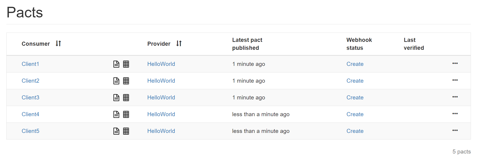
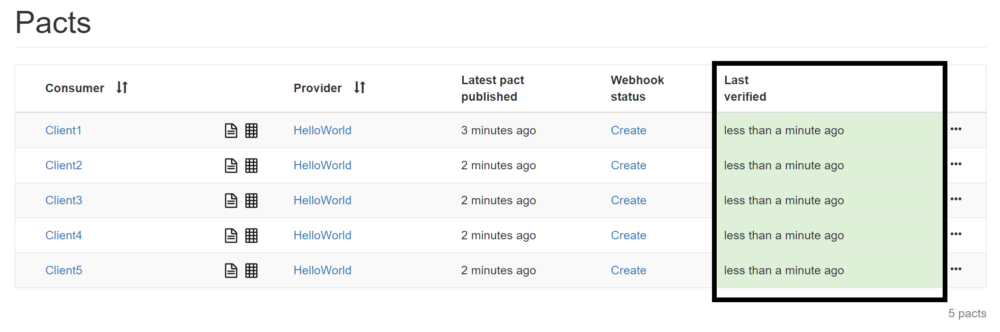
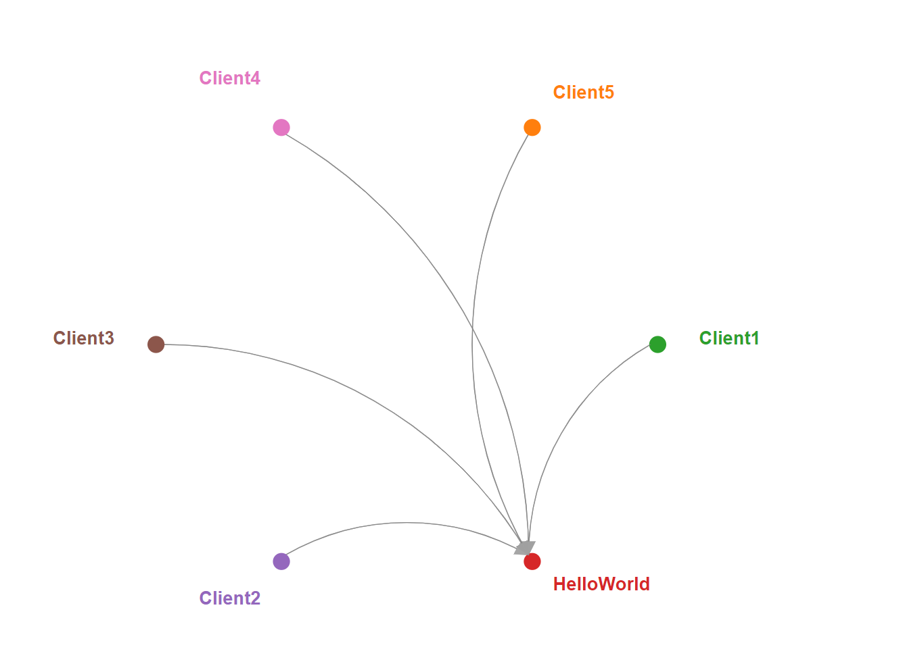

Labs around Consumer Driven Contracts (CDC) with [Pact](https://docs.pact.io/) and its [Broker](https://github.com/pact-foundation/pact_broker)  
Code source is written in C# on .Net Core.

## Clone repo

```
git clone https://github.com/agilepartner/pact-sandbox.git
```

## Projects

### AgilePartner.Pact.Lib
Utilities to do CDC with Pact :
* ``RestProxy`` a simple Rest Proxy.
* ``PactFixture`` Represents a shared context for xunit tests. On Dispose it will publish Pact file
    * On disk (folder pacts/)
    * In a broker (on "http://localhost")
* ``client_should`` base class for consumers tests (initialize PactFixture).

### AgilePartner.Pact.Consumers
This solution contains Consumers project (called ClientX)  
Each Consumer project contains a Client class and a client_should (test class).

The tests **define the expected behaviors** from the consumer regarding the provider and check the behavior of the client based on the contract defined in the test :

```CSharp
    [Fact]
    public async Task get_helloworldv1()
    {
        mockProviderService
            .Given("Client1 get at helloworld")
            .UponReceiving("A message")
            .With(new ProviderServiceRequest
            {
                Method = HttpVerb.Get,
                Path = "/api/v1.0/helloworld"
            })
            .WillRespondWith(new ProviderServiceResponse
            {
                Status = 200,
                Headers = new Dictionary<string, object>
                {
                    { "Content-Type", "application/json; charset=utf-8" },
                },
                Body = new
                {
                    message = "Hello world v1"
                }
            });

        await consumer.GetHello();

        mockProviderService.VerifyInteractions();
    }
```

### AgilePartner.Pact.Providers
This solution contains :
* a Provider project containing an HelloWorld api with GET implemented in 4 versions.
* a test project in which we design our api based on the contract(s) defined by the consumers.

```CSharp
    public helloworld_api_should(
        ITestOutputHelper output)
    {
        this.config = new PactVerifierConfig
        {
            Outputters = new List<IOutput> { new XUnitOutput(output) },
            PublishVerificationResults = true,
            ProviderVersion = "1.0.0"
        };
    }

    private void VerifyContractWithConsumer(string consumerName)
    {
        IPactVerifier pactVerifier = new PactVerifier(config);
        pactVerifier
            .ServiceProvider("Helloworld", SERVER_URI)
            .HonoursPactWith(consumerName)
            .PactUri($"http://localhost/pacts/provider/HelloWorld/consumer/{ consumerName }/latest")
            .Verify();
    }

    [Fact]
    public void respect_its_contract_with_client1()
    {
        VerifyContractWithConsumer("Client1");
    }
```

## Start the Pact broker

The solutions download the pact contracts expressed as json from a pact broker.

```
cd broker
docker-compose up
```
The broker can be accessed at http://localhost/

## Setup contracts in your broker
* Run consumer tests, it will publish the contracts



* Run provider tests, it will publish the verification results



* Then you can browse dependencies graph



In other languages :
* [js](https://github.com/lucasmajerowicz/pact-node-example/blob/master/app/client/spec/PostServiceClient.spec.js)
